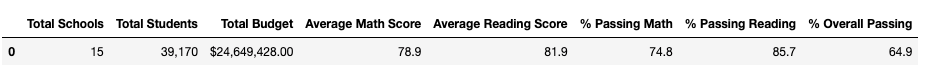

# School_District_Analysis

## Overview
The purpose of this analysis is to replace 9th grade reading and math scores at Thomas High School(THS) and rerun the entire school district analysis to see how the changes affect the overall analysis. 

## Results
   - The new district summary we created that excluded the 9th grade reading and math scores from THS had a slightly lower average math score, the same average reading score, a higher % passing math score, a lower % passing reading score, and a lower % overall passing score than the initial district summary we created. 
     - Original district summary
       - 
     - New district summary
       - 

   - The new school summary shows a slightly lower average math score for THS, a slightly higher average reading score, a lower % passing math, a lower % passing reading, and lower % overall passing than the initial school summary we created. 
     - Original school summary
       - 
     - New school summary
       - 
   - By replacing the 9th grade math and reading scores at THS, the school's overall performance dropped slightly but they are still the #2 performing school in the district. 
     - Original top 5 schools
       - 
     - New top 5 schools
       - 
   - When we replaced the 9th grade scores:
     -  The math and reading scores for grade 9 at THS are shows as "nan"
       - Original math scores by grade
         - 
       - Original reading scores by grade
         - 
       - New math scores by grade 
         - 
       - New reading scores by grade
         - 
     - Scores by school spending, school size, and school type all remained unchanged from the initial analysis
       - Scores by school spending
         - 
       - Scores by school size
         - 
       - Scores by school type
         -        

## Summary

